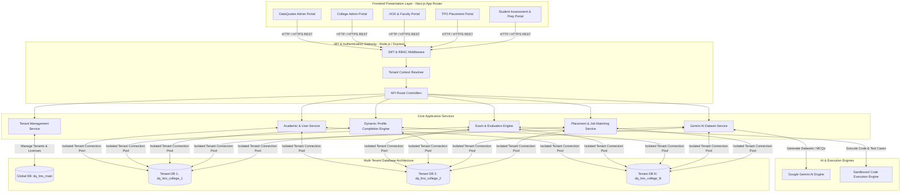
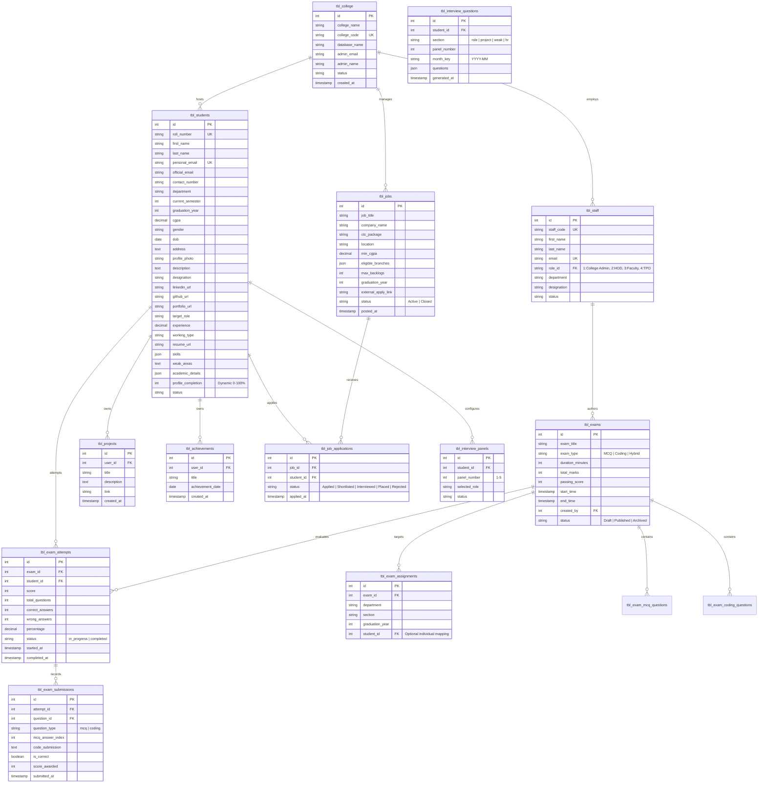
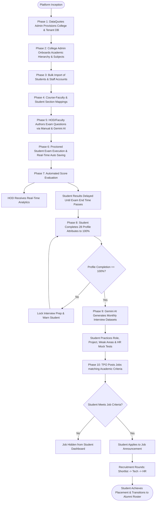
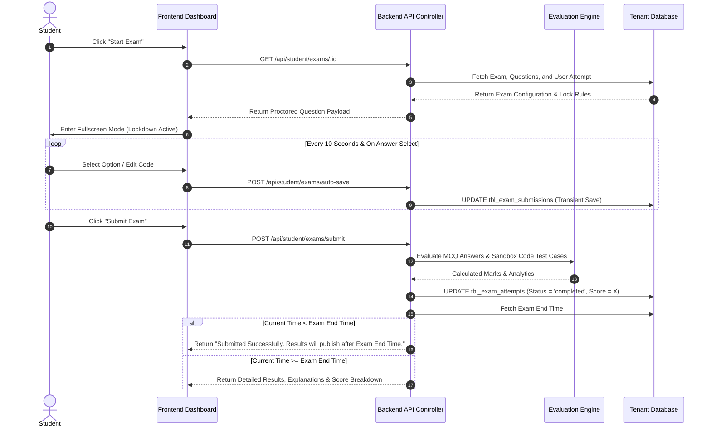
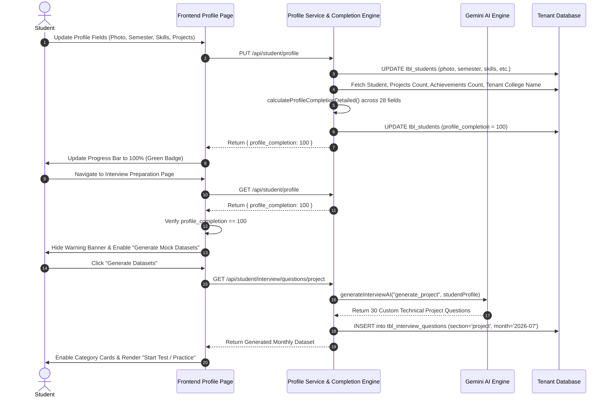
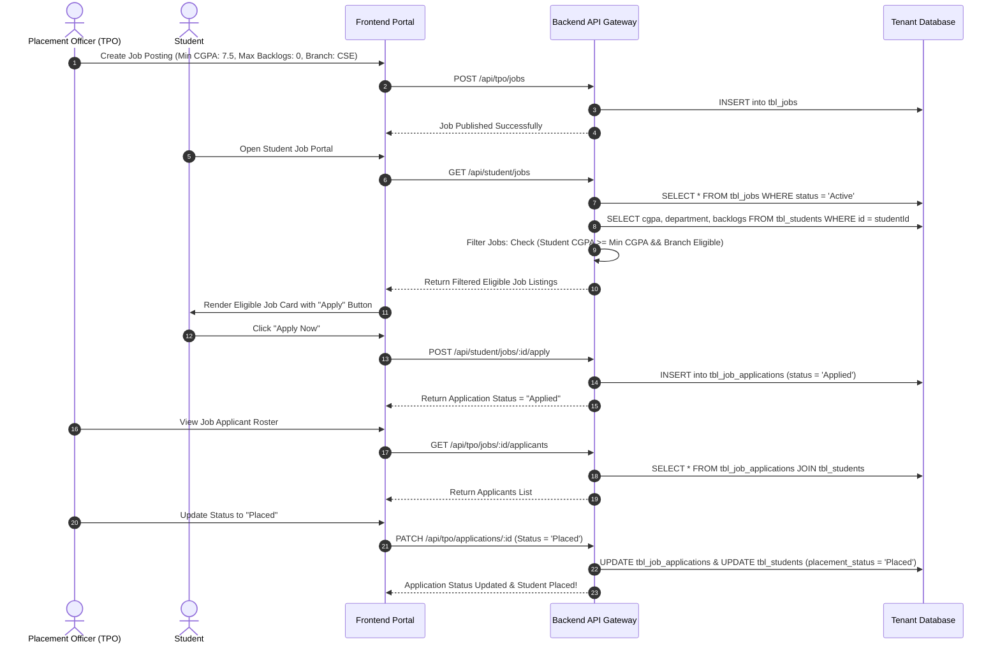
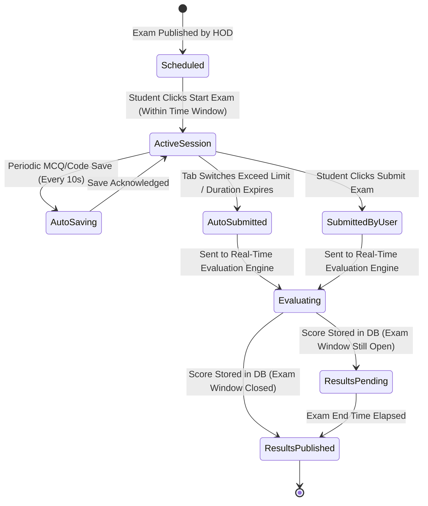
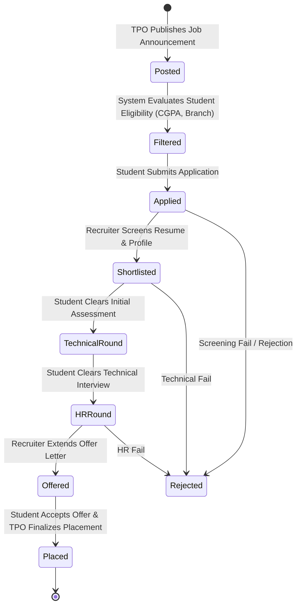

# DataQuotes LMS (Multi-Tenant) - Master Project Diagrams & Architecture Blueprint

**Document Purpose**: Complete Graphical & Text-Based Technical Architecture Diagrams, Entity-Relationship Models, Sequence Workflows, and State Transition Diagrams for DataQuotes LMS.  
**Strict Code Policy Compliance**: No source code, APIs, or database schemas have been altered. This document serves strictly as architectural documentation.

---

## 1. High-Level System Architecture Diagram

---

## 2. Complete Entity-Relationship (ER) Diagram

The ER Diagram illustrates the relational database architecture across tenant databases (`dq_lms_<college_code>`):

---

## 3. Master End-to-End Business Flow Diagram

---

## 4. Sequence Diagrams

### 4.1 Proctored Student Exam Execution & Delayed Result Sequence

---

### 4.2 Dynamic 100% Profile Completion & Gemini AI Interview Prep Sequence

---

### 4.3 TPO Job Posting & Student Placement Application Sequence

---

## 5. State Transition Diagrams

### 5.1 Student Exam Session State Machine

---

### 5.2 Job Application Lifecycle State Machine

---

## 6. Project Architecture Verification & File Mapping

| Architectural Component | Documented File Location | Status |
| :--- | :--- | :---: |
| **DataQuotes Admin API & Tenant Pool** | [c:\lms-b2b-api\src\config\db.ts](file:///c:/lms-b2b-api/src/config/db.ts) | Verified |
| **Schema Migration Engine** | [c:\lms-b2b-api\src\config\schemaMigration.ts](file:///c:/lms-b2b-api/src/config/schemaMigration.ts) | Verified |
| **Student Repository & Profile SQL** | [c:\lms-b2b-api\src\modules\student\student.repository.ts](file:///c:/lms-b2b-api/src/modules/student/student.repository.ts) | Verified |
| **Dynamic 100% Profile Completion Engine** | [c:\lms-b2b-api\src\modules\student\profileCompletion.ts](file:///c:/lms-b2b-api/src/modules/student/profileCompletion.ts) | Verified |
| **Gemini AI Interview Dataset Service** | [c:\lms-b2b-api\src\modules\student\interview\interview.service.ts](file:///c:/lms-b2b-api/src/modules/student/interview/interview.service.ts) | Verified |
| **Frontend Student Profile Page** | [c:\lms-b2b\components\students\profile\page.tsx](file:///c:/lms-b2b/components/students/profile/page.tsx) | Verified |
| **Frontend Interview Preparation Dashboard** | [c:\lms-b2b\components\students\interview\InterviewPrep.tsx](file:///c:/lms-b2b\components\students\interview\InterviewPrep.tsx) | Verified |

---

> [!TIP]
> This markdown document contains complete, valid **Mermaid** blocks (`mermaid`). You can render it directly in GitHub, Antigravity IDE, Notion, VS Code Mermaid previewers, or export it to PNG/SVG diagrams using any online Mermaid CLI or web tool.
